## now

I build **Mirage**, HelloBike's internal agent harness. A harness is the layer
nobody sees in a demo and everybody feels in daily use: how tool calls are
scheduled, how context gets compacted before it overflows, how a skill loads
without polluting the prompt, how a failed edit surfaces instead of silently
passing. The model is a component. The harness decides whether that component
is usable every day by a whole engineering org or just impressive once.

Most of the work is not prompt engineering. It is plumbing, permissions,
verification loops, and deciding what an agent must never be allowed to do
unattended.

## harness

I run Claude Code, Codex, Antigravity, and pi side by side, on purpose. They
disagree about where an agent's authority ends, and reading those disagreements
is the fastest way to learn what belongs in a harness.

Claude Code is the reference for tool ergonomics: its edit and search
primitives set the bar for what an agent should be able to do without shelling
out. Codex is the reference for staying in one loop long enough to finish.
Antigravity is worth watching for how far the IDE surface can absorb the agent
instead of sitting next to it.

pi is the one I actually bend. Extensions, custom tools, skills, prompt
templates, themes, its TUI, all of it is open at the seams, so a hypothesis
about harness design takes an afternoon to test instead of a quarter to
schedule. Most of what ends up in Mirage was a pi experiment first.

## stack

```
lang      Java  TypeScript  Python  Go
backend   Spring  Node
frontend  Next.js  React
data      MySQL
infra     Docker  Git
```

## projects

`Mirage` internal agent harness at HelloBike. Not public.

[`Lovemaster`](https://github.com/KkOma-value/Lovemaster) AI-driven
application, my own testbed for agent integration outside work.

## contact

```
mail    lijinhang460@gmail.com
github  github.com/KkOma-value
```
